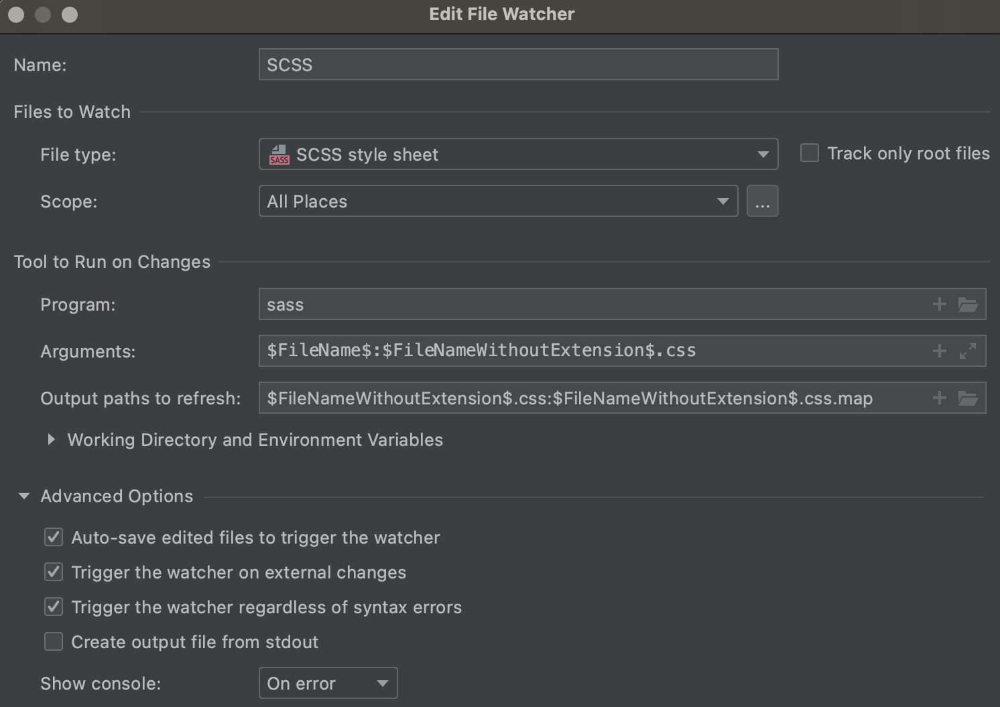
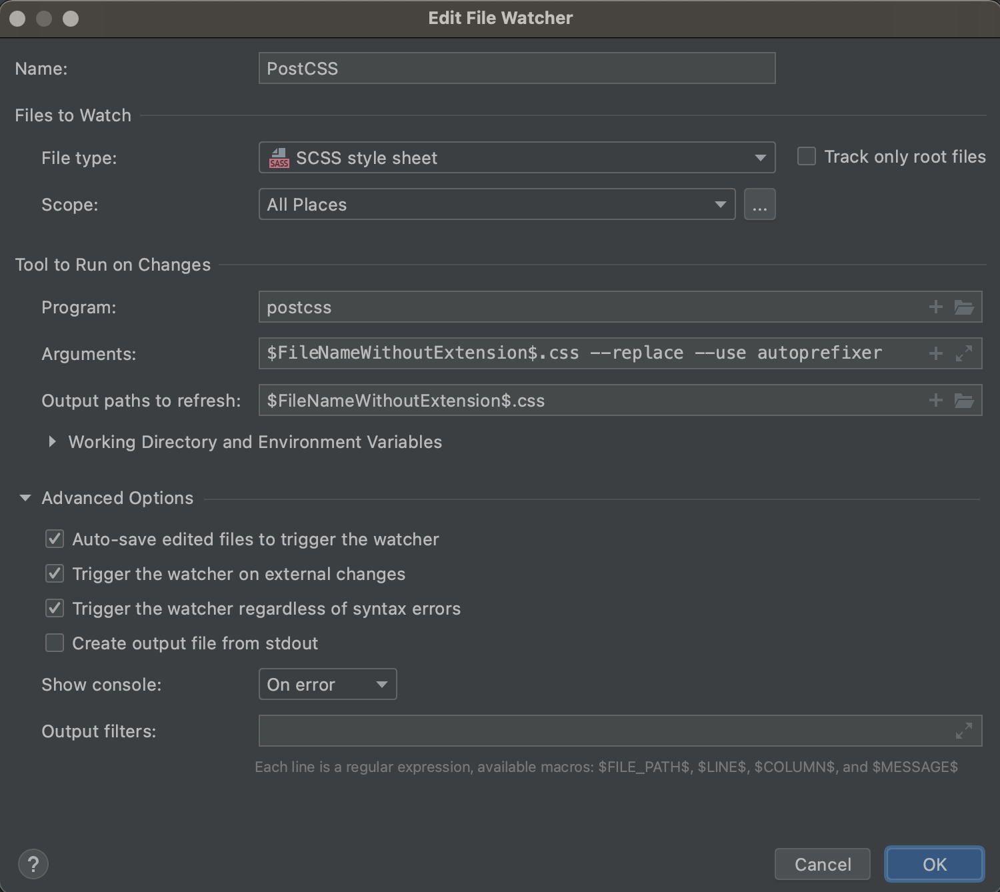
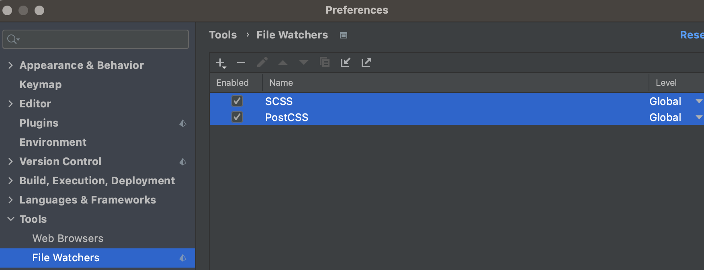

# Jetbrains-IDE-SCSS-Autoprefixer
SCSS (SASS) Compile and PostCSS Autoprefixer for Jetbrains IDE (Rider, Webstorm, PHPStorm) 

1. Install sass, postcss, autoprefixer:
```
npm install -g sass postcss autoprefixer
```
2. Go to `Preferences` -> `Tools` -> `File watchers`
3. Add SCSS wathcer:<br/>
Program: `sass`<br/>
Arguments: `$FileName$:$FileNameWithoutExtension$.css`<br/>
Output aths to refresh: `$FileNameWithoutExtension$.css:$FileNameWithoutExtension$.css.map`

4. Add another SCSS watcher (to the end):<br/>
Program: `postcss`<br\>
Arguments: `$FileNameWithoutExtension$.css --replace --use autoprefixer`<br/>
Output paths to refresh: `$FileNameWithoutExtension$.css`<br/>

Check order:

